CS539 Machine Learning Project
===
Topic: Heart Disease Prediction Based On Machine Learning
===

Group Member: Yuxiao Peng, Zhaohui Li, Longsheng Xie
---
Data:
---
https://www.kaggle.com/ronitf/heart-disease-uci

1.Introduction:
---
Heart disease describes a range of conditions that affect your heart. Diseases under the heart disease umbrella include blood vessel diseases, such as coronary artery disease, heart rhythm problems and heart defects you are born with, among others. The term “heart disease” is often used interchangeably with the term “cardiovascular disease”. Cardiovascular disease generally refers to conditions that involve narrowed or blocked blood vessels that can lead to a heart attack, chest pain or stroke. Other heart conditions, such as those that affect your heart’s muscle, valves or rhythm, also are considered forms of heart disease.

Heart disease is one of the biggest causes for morbidity and mortality among the population of the world. Prediction of cardiovascular disease is regarded as one of the most important subjects in the section of clinical data analysis. The amount of data in the healthcare industry is huge. This data is not always made use to the full extent and is often underutilized. Using this huge amount of data, a disease can be detected, predicted or even cured. This makes heart disease a major concern to be dealt with. But it is difficult to identify heart disease because of several contributory risk factors such as diabetes, high blood pressure, high cholesterol, abnormal pulse rate and many other factors. Due to such constraint’s scientists have turned towards modern approaches like Data Mining and Machine Learning for predicting the disease.

Machine learning has been shown to be effective in assisting in making decisions and predictions from the large quantity of data produced by the healthcare industry. we try to concentrate on heart disease prediction. Using machine learning techniques, the heart disease can be predicted. The medical data such as Blood pressure, hypertension, diabetes, cigarette smoked per day and so on is taken as input and then these features are modelled for prediction. This model can then be used to predict future medical data. The algorithms like K-nearest neighbor, Naïve Bayes, support vector machine and decision tree are used. The accuracy of the model using each of the algorithms is calculated. Then the one with a good accuracy is taken as the model for predicting the heart disease.

2.Data Scanning:
---
1. Age: displays the age of the individual.
2. Sex: displays the gender of the individual using the following format:
    * 1 = male
    * 0 = female
3. Chest-pain type: displays the type of chest-pain experienced by the individual using the following format:
    * 1 = typical angina
    * 2 = atypical angina
    * 3 = non -- anginal pain
    * 4 = asymptotic
4. Resting Blood Pressure: displays the resting blood pressure value of an individual in mmHg
5. Serum Cholesterol: displays the serum cholesterol in mg/dl
6. Fasting Blood Sugar: compares the fasting blood sugar value of an individual with 120mg/dl.
    * If fasting blood sugar > 120mg/dl then: 1 (true)
    * else: 0 (false)
7. Resting ECG: displays resting electrocardiographic results:
    * 0 = normal
    * 1 = having ST-T wave abnormality
    * 2 = left ventricular hypertrophy
8. Max heart rate achieved: displays the max heart rate achieved by an individual.
9. Exercise induced angina:
    * 1 = yes
    * 0 = no
10. ST depression induced by exercise relative to rest: displays the value which is integer or float.
11. Peak exercise ST segment:
    * 1 = upsloping
    * 2 = flat
    * 3 = downsloping
12. Number of major vessels (0–3) colored by flourosopy: displays the value as integer or float.
13. Thal: displays the thalassemia:
    * 3 = normal
    * 6 = fixed defect
    * 7 = reversible defect
14. Diagnosis of heart disease: Displays whether the individual is suffering from heart disease or not:
    * 0 = absence
    * 1, 2, 3, 4 = present

We made some charts to analyze the data:

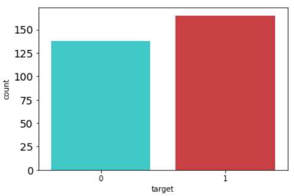
The proportion of heart dicease in data

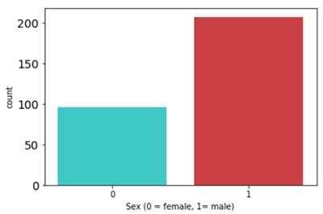
The sex ratio in data

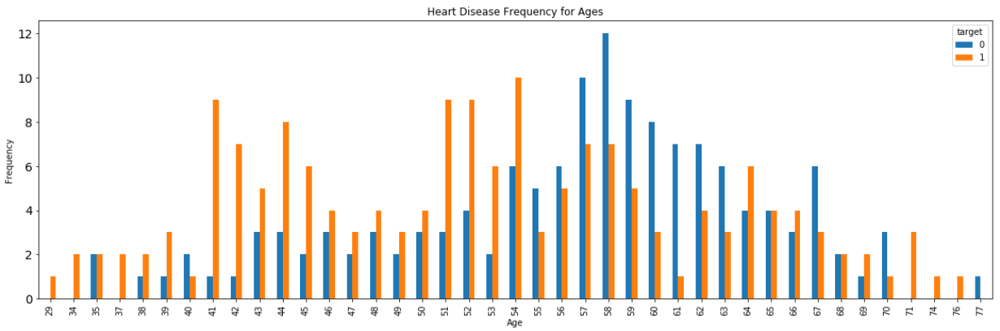
The heart disease frequency for different ages

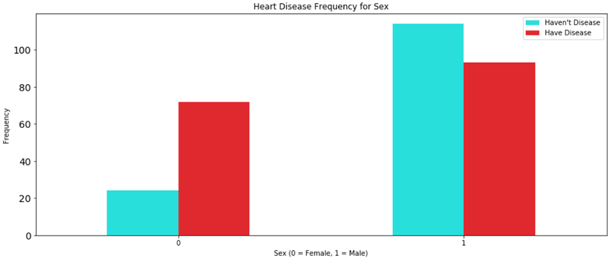
The heart disease frequency for different sex

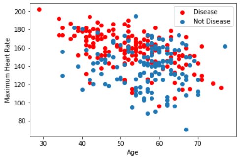
The age and maximum heart rate

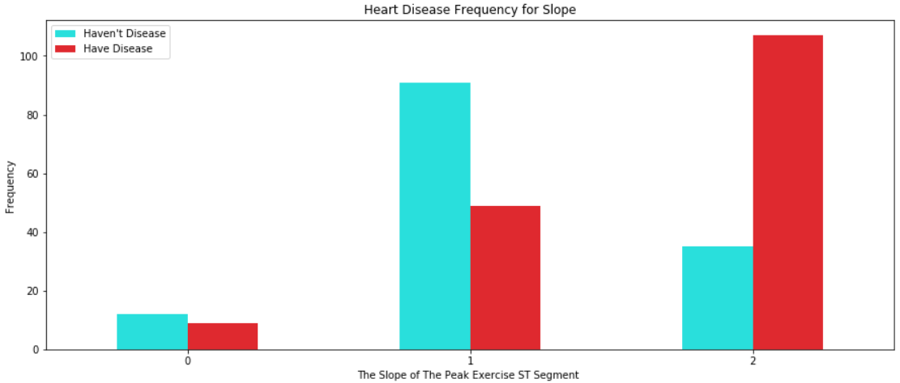
The heart disease frequency for slope

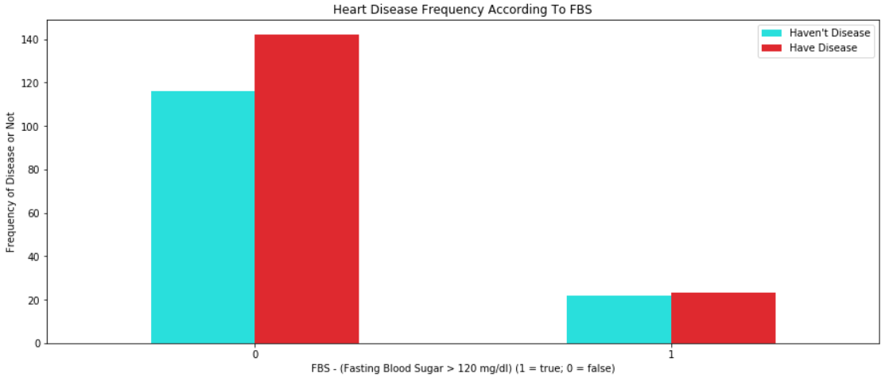
The heart disease frequency according to FBS

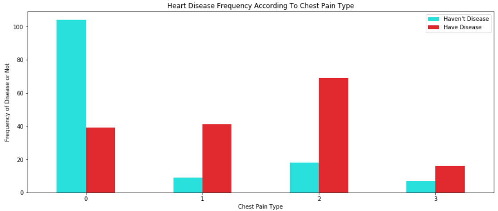
The heart disease frequency acccording to chest pain type
3.Data Processing:
---
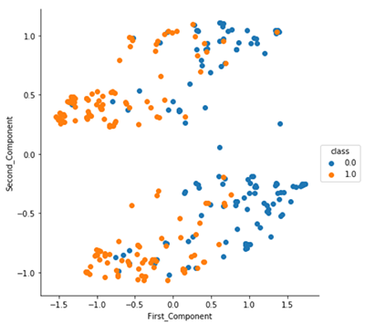
pca n=2 evaluation
no primary 
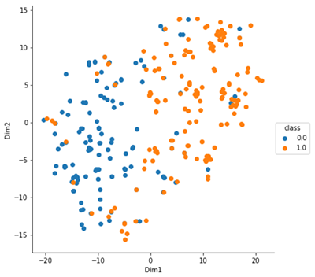

4.Model Selection:
---
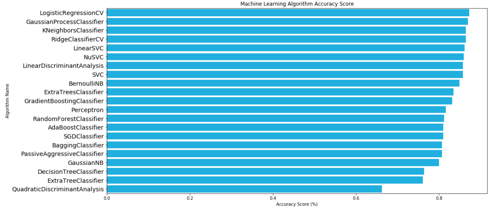
k=10 cross v
train 70% test 20%
5.Model Evaluation:
---
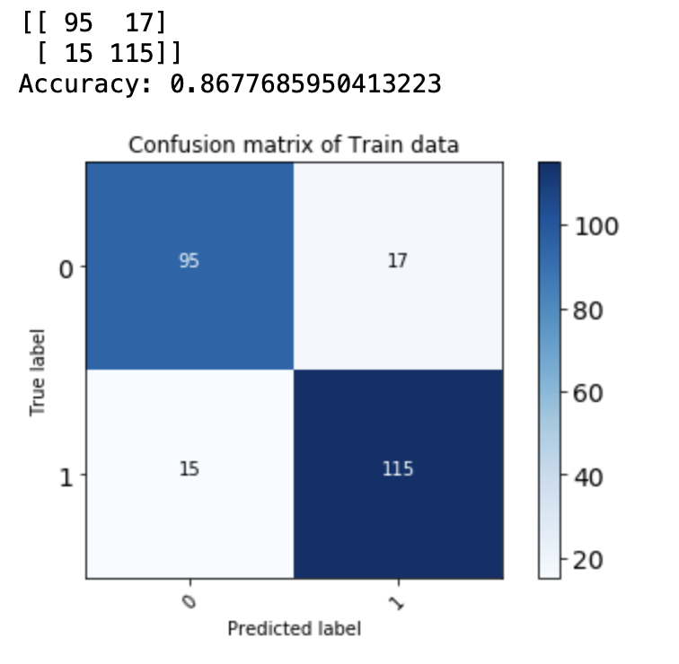

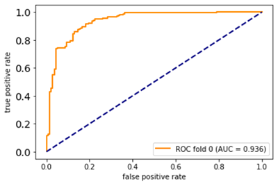

6.Results:
---

7.Conclusion:
---

